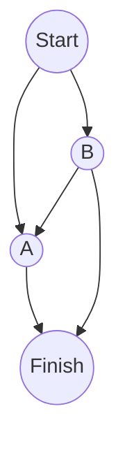
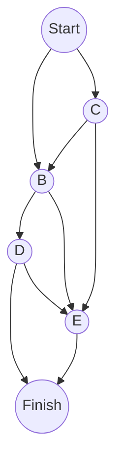
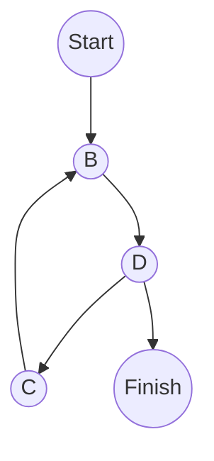
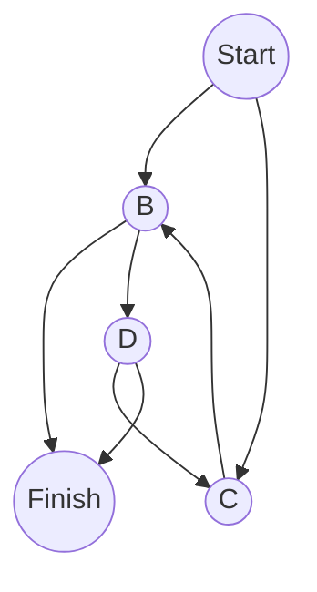

[[Grokking Algorithms]]

## Working with Dijkstra's algorithm

Dijkstra's algorithm is used for finding the route with the smallest total of each edge's value, this is done in 4 steps:
1. Find the cheapest node, which is the one with the smallest value to reach.
2. Check the neighbors of the node to see if they there's a cheaper route to them, if so, update their cost.
3. repeat until whole graph has been checked.
4. calculate the final path.

## Terminology

*weights* are what the values on edges are referred to in a graph. This type of graph is called a *weighted graph* and is what Dijkstra's algorithm is meant for, on the other hand, *unweighted graphs* are what the breadth-first search algorithm is meant for. Graphs with cycles though are not good for Dijkstra's algorithm as it can lead to just infinitely growing weights/loops, so the algorithm is best suited for *directed acyclic graphs*, also known as DAGs.

## Negative-weight edges

negative weights are values that go lower than the baseline value, 0, and therefore Dijkstra's algorithm can't work as it assumes nodes connected with an edge valued at 0 is the lowest possible and is processed before nodes that go to said node with a negative-weight can process it.

## Implementation

Example:

(I can't find a mermaid graph that can have a decent directed graph with text on the edges, so I'll be describe the values on each edge below):
- Start -> A: 6
- Start -> B: 2
- A -> Finish: 1
- B -> A: 3
- B -> Finish: 5

Three hash tables are necessary for this implementation

### Graph
The graph utilizes a hash table within each entry so then all neighboring nodes can have their associated edge value.

| Node   | Neighbors         |
| ------ | ----------------- |
| Start  | [A:6], [B:2]      |
| A      | [Finish:1]        |
| B      | [A:3], [Finish:5] |
| Finish | -                 |

### Node Cost
The node cost associates the currently known best value for each node.

| Node   | Cost     |
| ------ | -------- |
| A      | 6        |
| B      | 2        |
| Finish | $\infty$ |

### Node Parent
The node parent associates each node with the currently known parent for the best route

| Node   | Parent |
| ------ | ------ |
| A      | Start  |
| B      | Start  |
| Finish | -      |

## Exercise

- 7.1: In each of these graphs, what is the weight of the shortest path from start to finish?
	- A: 8 Start -> B -> E -> Finish

Start -> B: 5
Start -> C: 2
B -> D: 4
B -> E: 2
C -> B: 8
C -> E: 7
D -> Finish: 3
D -> E: 6
E -> Finish: 1

- 7.1
	- B: 60 Start -> B -> D -> Finish

Start -> B: 10
B -> D: 20
C -> B: 1
D -> C: 1
D -> Finish: 30

- 7.1
	- C: 4 A -> B -> Finish

A -> B: 2
A -> C: 2
B -> Finish: 2
B -> D: 2
C -> B: 2
D -> C: -1
D -> Finish: 2