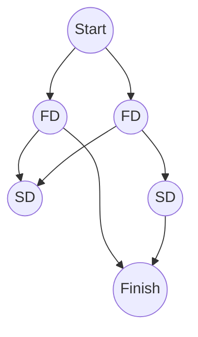
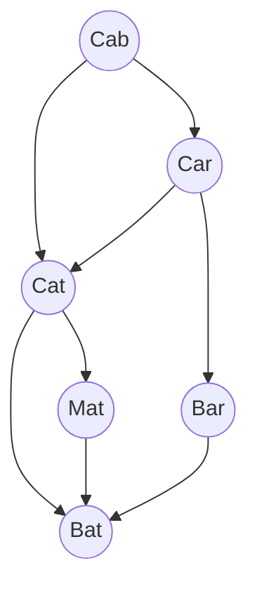
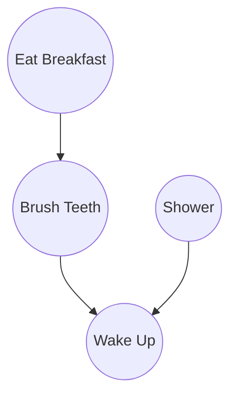
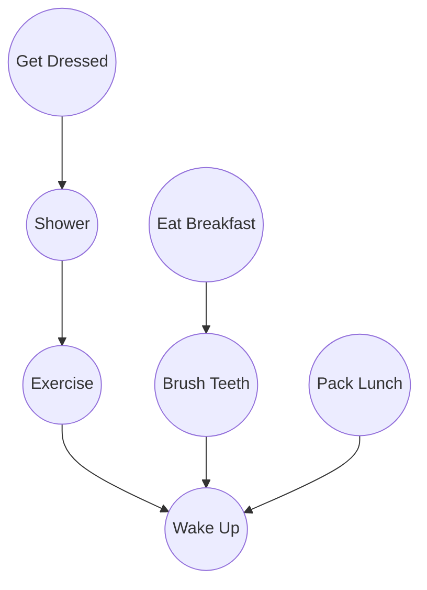
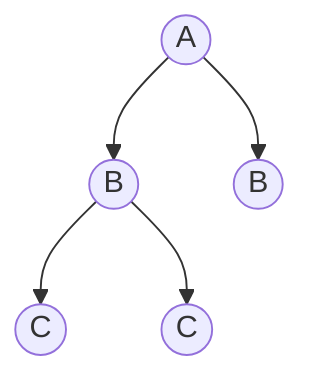
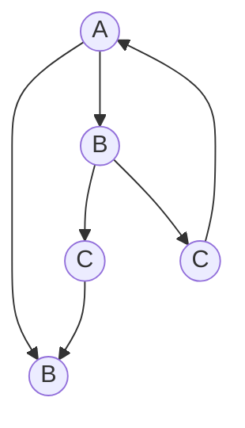
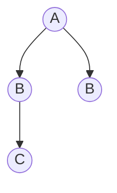

## What is a graph?

A graph is network of *nodes* and *edges*, edges are what connects one node to another and adjacent nodes are called *neighbors*. These connections describe the relevance between each node.

## Breadth-first search

An algorithm for answering 2 types of questions:
- Is there a path from node A to node B?
- What is the shortest path from node A to node B?
How this algorithm works is that you go from the starting node and check every neighboring node, adding the neighboring nodes of the currently searched neighboring node to the list of nodes to search each time you don't find what you're searching for.

### Queue

A queue is how you would manage to ensure that the lowest-degree neighbors are always searched before the next-degree neighbors. This only has 2 operations, *enqueue* and *dequeue*, adding to the end of the queue and removing from the front of the queue respectively. This is called a FIFO, First In, First Out, unlike how a stack works where it's LIFO, Last In, First Out.

### Exercises

- 6.1 Find the length of the shortest path from start to finish.

As shown in the above graph, at the starting point we've got 2 first-degree neighbors, after those neighbors we've got 2 second-degree neighbors and the finishing node as a neighbor, making the shortest path only 2 degrees away.

- 6.2 Find the length of the shortest path from "cab" to "bat".

As shown in the above graph, the first degrees are "cat" and "car", second degrees are "mat", "bar" and "bat", the finish node. So the shortest path from "cab" to "bat" is 2 degrees, going from "cab", "cat", and then finally "bat".

## Implementing the graph

The graph can be represented as a hash table where each node has a slot and their neighbors are represented as an array when their slot is referenced. A **directed graph** is a graph where the relationship between nodes are only one way defined by arrows, meaning a node being pointed to is a neighbor of the pointing node but the pointing node is not a neighbor of the pointed node. On the other hand, an **undirected graph** has no arrows and therefore both of the nodes that are connected are neighbors.

## Implementing the algorithm

1. Have a queue of the nodes to be checked
2. dequeue a node
3. skip node if it's an already searched node
4. check if the node matches the predicate
5. if yes, done, else, add the node to a list of searched nodes and add that node's neighbors to the queue
6. loop
7. if the queue is empty, none of the nodes match the given predicate

### Running time

The running time of searching a graph with breadth-first search is O(V+E), V for the number of vertices and E for the number of edges. This is due to the fact that while searching, you have to go through every edge (arrows) in combination to keeping a queue of the vertices (nodes), which adds the total number of vertices in the graph, therefore O(V+E).

### Exercise

- 6.3 For these three lists, mark whether each one is valid or invalid.
	- A.
		1. Wake up
		2. Shower
		3. Eat breakfast
		4. Brush teeth
		Invalid
	- B.
		1. Wake up
		2. Brush teeth
		3. Eat breakfast
		4. Shower
		Valid
	- C.
		1. Shower
		2. Wake up
		3. Brush teeth
		4. Eat breakfast
		Invalid

- 6.4 Here's a larger graph. Make a valid list for this graph.

1. Wake up
2. Exercise
3. Brush teeth
4. Pack lunch
5. Shower
6. Eat breakfast
7. Get dressed

- 6.5 Which of the following graphs are trees?
A. 

B.

C.

A and C are trees as they have no edges that point back.