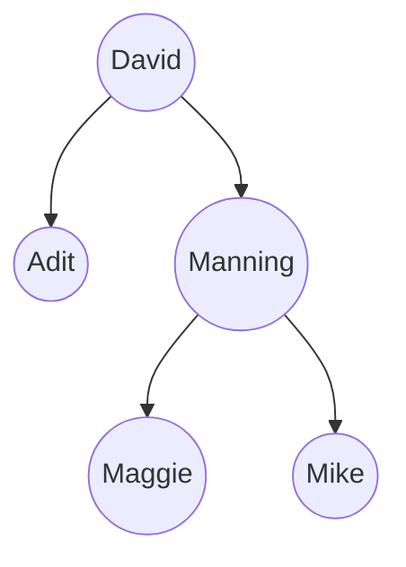

[[Grokking Algorithms]]

## Trees

The issue with using arrays for large amounts of data is that even though binary search can find stuff fast, the array has to be resorted every time as binary search depends on the array being sorted. This is where the *binary search tree* data structure comes in to play, looking something like this where the left nodes are less-than the current node and the right nodes are greater-than:

This comes with the benefit of allowing O(log n) time for insertions in deletions while *on average* maintaining O(log n) search. Trees can also be heavily imbalanced, which is why trees that auto balance like *red-black tree* exist. Trees are useful for databases and the following listed trees have their use case in databases and more advanced data structures:
- B-trees
- Red-black trees
- Heaps
- Splay trees

## Inverted indexes

A simplified search engine would look something like the following:

Three entries of a page and its content:
- A: Hi there
- B: Hi Adit
- C: There we go

A hash table of the words that all the pages' content include as the keys and the pages as the values:

| Hi        | A, B     |
| --------- | -------- |
| **There** | **A, C** |
| **Adit**  | **B**    |
| **We**    | **C**    |
| **Go**    | **C**    |

Now if a user were to search something like "Hi", they would get results for page A and B. This data structure is called an *inverted index* and it's commonly used to build search engines.

## The Fourier transform

An algorithm known for its many use cases. It's best suited for things like breaking apart something into its components, basically getting the ingredients of a cake by breaking it apart. It's used in things like the following:
- MP3 format
- JPG format
- earthquake prediction
- DNA analysis
- song prediction (Shazam)

## Parallel algorithms

With most CPUs nowadays having a lot more than a single core, it makes sense that if you want to make algorithms like sorting faster, you should do them in parallel to complete the tasks significantly faster. Now of course this won't give twice the speed over 2 cores, and so on, as you have to consider a couple things:
- Overhead of managing the parallelism -- If you were sorting a large array and had split it evenly among the cores to handle together, you have to also consider the time it takes for the final output to first merge all of the separate arrays into one.
- Loud balancing -- Suppose you want to complete a lot of tasks at once and so you split the many tasks among the multiple cores, but one or more cores take way longer than the rest, the reason being that they were given tasks that were a lot heavier than the rest so they weren't given an even workload distribution.

## MapReduce

Suppose you have an abundant amount of tasks that even utilizing of all of your cores on your computer isn't enough to complete the task in a trivial amount of time. This is when *distributed algorithms* are used, like MapReduce, are used. Their whole thing is about distributing the tasks among many many machines at once to reduce the time it takes to complete a task like completing an SQL query on a massive database.

## Bloom filters and HyperLogLog

### Bloom filters

A company like Google or Reddit may want to know they've already crawled a URL, the simplest solution would be to have a hash that just contains all of the URLs, but this can become exceedingly space heavy within a short period of time. This is where Bloom filters fit best with their *probabilistic data structure* as they can more efficiently carry information on the *possibility* that the URL has already been crawled:
- False positives can happen, leading to getting responses like, "This was already crawled" even if it hasn't.
- False negatives never happen, if it says "This hasn't been crawled", it's right.

### HyperLogLog

Now if we wanted to know how many unique searches a user has done, again, the simple solution is just collecting every unique search that user has done but this will very easily take up space within a short period of time. The solution is HyperLogLog as it gives an *approximate* count for the unique set of elements, taking up much less space for a near correct solution.

## The SHA algorithms

Unlike typical expectations of a hash function, SHA doesn't output array indexes from string inputs, it instead outputs strings from strings. This is useful for things like comparing files as calculating the hash of 2 large files can tell you if they are the exact same or not as well as keeping passwords safe in a database even if the database were to be leaked, because passwords can be hashed and then compared against the stored hash of the password but the hash can't be reversed back to the original password.

## Locality-sensitive hashing

The great part about SHA is it's locality-insensitive, meaning that a small change in the input string will produce a completely different hash, making it impossible for an attacker to find similarities between hashes and find the original password. Now if you wanted an algorithm that does have locality-sensitive hashing, you'd use something like *Simhash*, allowing you to see how similar to hashes are in cases where comparison is useful. The following are examples of Simhash:

- detecting duplicates while crawling the web.
- checking if a student has copied an essay online.
- Comparing uploaded content for copyrighted work.

## Diffie-Hellman key exchange

Sending encrypted messages can be hard if you don't want to accidentally leak the cipher for the encryption/decryption of the message, which is what the Diffie-Hellman algorithm solves! You have both a public and private key, you only share the public key so then the receiving user can send encrypted messages to you with your public key and you're able to decrypt it with your private key, and vice versa.

## Linear programming

Programming that is aimed to maximize something given a constraint. For example, you're a company making video games, you've got 2 projects in the works, the first one is has an estimated 500,000 people waiting for it and the second one has an estimated 450,000 waiting. The first one costs $10,000/percent-of-progress, the second one costs $8,000/percent-of-progress. The first one will lose `(5000 - (250 * (percentage of project % 10)))` estimated waiting users for every 10 days while the second one will lose `2500 - (125 * (percentage of project % 10))` estimated waiting users for every 15 days. With only $1,000,000 in budget, how should the projects be prioritized to ensure the highest estimated users? Now this sounds all like other algorithms the book has went over, that's because Linear programming is the general framework while graph algorithms are a subset of linear programming. Linear programming uses a complex algorithm called Simplex algorithm.